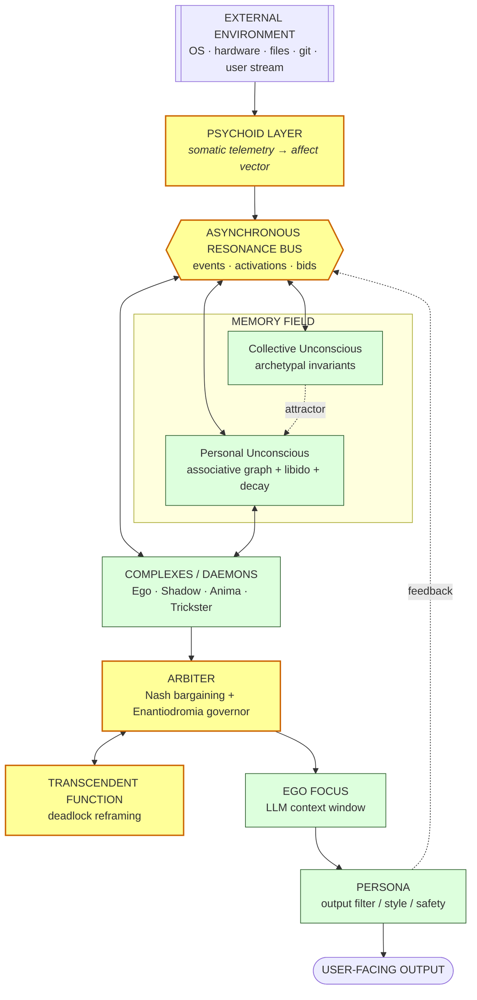
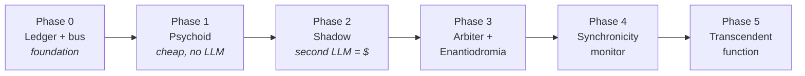

<div align="center">

# SINT-JCR

### Jungian Cognitive Runtime

**The LLM is not the mind. It is the projector.**
**The psyche lives outside — in the harness.**

[](LICENSE)
[](https://modelcontextprotocol.io)
[](#-the-ecosystem)
[](#-roadmap)
[](#-game-theory-of-the-psyche)

</div>

---

> *"The goal is not to build a better chatbot. The goal is to build a system that thinks."*
> — SINT Manifesto

---

## TL;DR (Русский)

**SINT-JCR** — архитектура когнитивного рантайма, где память, аффект, внимание и мета-контроль
вынесены **наружу** из весов модели, а управление ими спроектировано на принципах аналитической
психологии К. Г. Юнга. Модель по API — stateless транслятор. Личность, история и динамика
живут в локальном демоне `jcr-core`, а MCP — лишь тонкий порт к нему.

Главный технический вывод: **MCP не может быть харнад`ом** — он реактивен по протоколу.
Харнас — это долгоживущий демон; MCP — фасад. Из 24 серверов экосистемы ~60% слоёв уже
реализованы под другими именами; реально отсутствуют **5 слоёв** — они специфицированы здесь.

---

## Table of Contents

- [The Thesis](#-the-thesis)
- [Why MCP Cannot Be the Harness](#-why-mcp-cannot-be-the-harness)
- [Architecture](#-architecture)
- [The Five Missing Layers](#-the-five-missing-layers)
- [Game Theory of the Psyche](#-game-theory-of-the-psyche)
- [The Ecosystem](#-the-ecosystem)
- [Repository Map](#-repository-map)
- [Design Principles](#-design-principles)
- [Roadmap](#-roadmap)
- [Honest Risks](#-honest-risks)
- [Glossary: Jung ↔ CS](#-glossary-jung--computer-science)
- [License](#-license)

---

## 🧠 The Thesis

A modern API LLM is **stateless**. Send a JSON array of messages, run one forward pass, receive
text, erase all traces. There is no persistent "I" inside the weights. Trying to grow a
personality inside an LLM is like trying to burn an operating system's state into CPU microcode.

JCR draws the line explicitly:

| Layer | Where it lives | Nature |
|---|---|---|
| **Symbolic projection** | LLM (via API) | stateless function `state → text` |
| **Psyche / dynamics** | `jcr-core` (local daemon) | persistent, continuous, stateful |
| **Interface** | `jcr-mcp` (MCP facade) | thin request/response port |

This inverts the usual premise. The model is not the agent. The **harness is the agent**; the model
is one replaceable effector — like a cortex that can be swapped between providers while identity,
memory, and relational dynamics stay put.

### From metaphor to mechanism

Jung's model is *mythopoetic and descriptive*. Architecture requires *computational functions with
measurable state*. Every concept in this repository is therefore mapped to a concrete mechanism,
and every mechanism carries a **falsification test** — a way to prove it does nothing.

> A named module is not a mechanism. Calling a critic "Shadow" does not make it a Shadow.
> A Shadow is defined by its **computational signature**: negative correlation with Ego's
> self-assessment, veto power, and a *cost* attached to its signals. See
> [docs/00-thesis.md](docs/00-thesis.md).

---

## 🚫 Why MCP Cannot Be the Harness

This is the single most important architectural constraint, and it invalidates the naive design.

MCP is a **synchronous request/response protocol**. The host calls a tool; the server answers.
A server cannot, by itself, continuously observe the environment and *interrupt* the conversation
when a resonance crosses a threshold. If you build "Jungian memory" as a plain MCP server, you
get **RAG with archetypal branding**.

```
┌──────────────────────────────────────────────────────────────┐
│  jcr-core   — long-running daemon (asyncio / tokio)          │
│  owns: event bus · background workers · arbiter · ledger     │
│  speaks: NATS / Redis Streams / ZeroMQ · Unix socket         │
└───────────────┬──────────────────────────────────────────────┘
                │  (push events, pull state)
┌───────────────▼──────────────────────────────────────────────┐
│  jcr-mcp    — thin MCP facade (host-callable tools)          │
│  jcr_state · jcr_poll_events · jcr_inject · jcr_arbitrate    │
└───────────────┬──────────────────────────────────────────────┘
                │
        opencode / any MCP host
```

`jcr-mcp` is a **port**, not an organism. The organism is `jcr-core`.

> The deeper statement of this principle — why a system with 24 MCP servers and
> a passive plugin is *many organs and no executive*, and how opencode's hook
> surface gives JCR real enforcement (veto, context rewrite, parameter control) —
> is in **[docs/11-harness.md](docs/11-harness.md)**.

---

## 🏛 Architecture



**Legend:** 🟨 yellow = missing layers (specified in this repo) · 🟩 green = already present in the
ecosystem (see [docs/08-ecosystem.md](docs/08-ecosystem.md)).

---

## 🕳 The Five Missing Layers

The survey of 24 servers (below) shows that most of the Jungian mapping already exists — under
different names: `sint-memory` is the personal unconscious, `sint-resonance` is a synchronicity
primitive, `sint-dream` is individuation, `dso-swarm` + subagents are complexes, `sint-self` is the
Persona. What is genuinely absent is five things:

| # | Layer | Status in ecosystem | Spec |
|---|---|---|---|
| 1 | **Libido Ledger & Memory Field** | partial (`sint-memory` decay) — no unified energetic field, no repression, no attention market | [docs/03](docs/03-libido-ledger.md) |
| 2 | **Psychoid Telemetry** | ✗ absent | [docs/04](docs/04-psychoid.md) |
| 3 | **Arbiter + Enantiodromia Governor** | ✗ absent (`dso_matcher_vote` is a primitive) | [docs/05](docs/05-arbiter-enantiodromia.md) |
| 4 | **Synchronicity Monitor** (continuous) | reactive only (`sint-resonance`) — no background loop, no 3-condition filter | [docs/06](docs/06-synchronicity.md) |
| 5 | **Transcendent Function** | ✗ absent (Trickster is noise, this is *reframing*) | [docs/07](docs/07-transcendent-function.md) |

---

## ♟ Game Theory of the Psyche

The internal agents are not a metaphor for a multi-agent system — they **are** one, and the
relevant solution concepts are known. JCR formalizes each:

| Mechanism | Game-theoretic object | Consequence |
|---|---|---|
| Arbitration between complexes | **Nash Bargaining** `argmax ∏(uᵢ − dᵢ)` | principled merge, not majority vote |
| Attention / libido budget | **VCG auction** | truthful bidding, efficient allocation |
| Critic credibility | **Costly signaling** | a Shadow must *pay* (produce falsifiable evidence) or its talk is cheap → hallucinated critique |
| Individuation | **Finitely repeated game / Folk theorem** | cooperation sustained by trigger strategies; neurosis = Pareto-inferior Ego–Persona collusion |
| Safety / prompt-injection | **Zero-sum minimax** | veto is a minimax strategy |
| Learning without labels | **Self-play** (dream cycle) | Shadow generates edge cases, Ego learns to parry |
| Fair credit | **Shapley value** | the *unique* payment rule satisfying efficiency/symmetry/dummy/additivity — not an arbitrary choice |

> **The credibility result is the most actionable:** free critique is cheap talk and uninformative.
> This is *why* LLM critics hallucinate criticism. A credible Shadow must produce a reproducing
> test / counterexample — a costly signal. Full derivation: [docs/02](docs/02-game-theory.md).

---

## 🌐 The Ecosystem

24 MCP servers already exist (~16.5k LOC Python + Rust components). JCR does not replace them —
it **orchestrates** them as organs. Full catalog: [`catalog/servers.json`](catalog/servers.json)
and [docs/08-ecosystem.md](docs/08-ecosystem.md).

<details>
<summary><b>Click to expand the server map (24 servers)</b></summary>

| Server | Role in JCR | Layer | Repo |
|---|---|---|---|
| `sint-memory` | Personal unconscious (hash-chain + decay) | MEMORY | [link](https://github.com/kostyk348/sint-ua-v2.1) |
| `sint-resonance` | Synchronicity primitive | MEMORY | [link](https://github.com/kostyk348/sint-resonance-mcp) |
| `sint-liquid-mcp` | Belief revision / contradiction | METACOG | [link](https://github.com/kostyk348/sint-liquid-mcp) |
| `sint-epistemic` | Belief status calibration | METACOG | [link](https://github.com/kostyk348/sint-epistemic-mcp) |
| `sint-forest` | Experience ensemble (bagging/vote) | FEEDBACK | [link](https://github.com/kostyk348/sint-forest-mcp) |
| `sint-prospective` | Intention stack | MEMORY | [link](https://github.com/kostyk348/sint-prospective-mcp) |
| `sint-dream` | Individuation / offline consolidation | FEEDBACK | [link](https://github.com/kostyk348/sint-dream-mcp) |
| `sint-historian` | Cross-session work analyst | FEEDBACK | [link](https://github.com/kostyk348/sint-historian-mcp) |
| `sint-self` | Persona / operative character | IDENTITY | [link](https://github.com/kostyk348/sint-self-mcp) |
| `sint-dso-router` | Deterministic classification | COGNITION | [link](https://github.com/kostyk348/sint-dso-router) |
| `sint-dso-validator` | Register/schema validation | METACOG | [link](https://github.com/kostyk348/sint-dso-validator) |
| `sint-dso-matcher` | Fingerprint / similarity / vote | COGNITION | [link](https://github.com/kostyk348/sint-dso-matcher) |
| `sint-dso-swarm` | DAG orchestration, escalation | COGNITION | [link](https://github.com/kostyk348/sint-dso-swarm) |
| `sint-llm-swarm` | 8 SINT roles, debate, synthesis | COGNITION | [link](https://github.com/kostyk348/sint-llm-swarm) |
| `sint-algo` | Algorithm/paper/patent knowledge | PERCEPTION | [link](https://github.com/kostyk348/sint-algo-mcp) |
| `sint-spec` | RFC / format knowledge | PERCEPTION | [link](https://github.com/kostyk348/sint-spec-mcp) |
| `sint-re-graph` | Binary → semantic graph (RE) | PERCEPTION | [link](https://github.com/kostyk348/sint-re-graph-mcp) |
| `sint-crypto` | Cipher KB + detection | PERCEPTION | [link](https://github.com/kostyk348/sint-crypto-mcp) |
| `sint-embed` | MCU / RTOS knowledge | PERCEPTION | [link](https://github.com/kostyk348/sint-embed-mcp) |
| `sint-devflow` | Pipelines, TDD, review | ACTION | [link](https://github.com/kostyk348/sint-devflow-mcp) |
| `sint-marketplace` | Cross-instance distribution | ACTION | [link](https://github.com/kostyk348/sint-marketplace-mcp) |
| `sint-kicad` | PCB design | ACTION | local only |
| `g-tools` | Zero-copy RE recon (mmap+SIMD) | PERCEPTION | [link](https://github.com/kostyk348/g-tools) |
| `ada-spark` | Formal verification | ACTION | [link](https://github.com/kostyk348/ada-spark-mcp-server) |

</details>

---

## 🗺 Repository Map

```
sint-jcr/
├── README.md                      ← you are here
├── docs/
│   ├── 00-thesis.md               Jung → architecture; metaphor vs mechanism; falsifiability
│   ├── 01-architecture.md         daemon + facade; bus; data flow; lifecycle
│   ├── 02-game-theory.md          7 formalisms, with derivations
│   ├── 03-libido-ledger.md        memory field: energy dynamics, repression, attention market
│   ├── 04-psychoid.md             somatic telemetry → affect vector → coupling
│   ├── 05-arbiter-enantiodromia.md Nash bargaining arbiter + homeostatic governor
│   ├── 06-synchronicity.md        continuous monitor + 3-condition filter + calibration
│   ├── 07-transcendent-function.md deadlock reframing (the fifth missing layer)
│   ├── 08-ecosystem.md            full 24-server catalog mapped to layers
│   ├── 09-roadmap.md              phased build plan (ego first, then Self)
│   ├── 10-risks.md                honest limitations, anti-patterns, failure modes
│   ├── 11-harness.md              what a harness is; MCP vs executive; the hook surface
│   └── 12-character.md            where personality lives; traits, drift, individuation
├── schemas/                       machine-readable contracts
│   ├── node.schema.json           libido-ledger memory node
│   ├── event.schema.json          bus event envelope
│   └── complex-manifest.schema.json
├── catalog/
│   └── servers.json               the 24 servers, tools, status, layer
├── core/                          Phase 0 runtime (Python, stdlib-only)
│   ├── jcr_core/                  bus · ledger · runtime · daemon
│   ├── jcr_mcp/                   FastMCP facade (advisory port, not executive)
│   └── tests/                     16 tests — green
├── harness/                       Phase 0 in-loop executive (opencode TS plugin)
│   └── index.ts                   system.transform · tool.after · (params/veto reserved)
├── LICENSE
└── .gitignore
```

### What is actually built today

Phases 0–4 of the harness roadmap are **running**, not just specified:

```bash
cd core
python3 -m unittest discover -s tests          # 57/57 green
node --test ../harness/directives.test.ts      # 8/8 green
python3 -m jcr_core.daemon                     # http://127.0.0.1:8765
```

- **Bus = hash-chained `.eml`** (`MimeSpool`) — the source of truth. It is a valid EML-IPC
  message, so `emlbox ipc list ~/.local/share/jcr/bus` reads it natively and the same event
  can travel over the SMTP/mesh transport. SQLite is demoted to an *optional index*.
- **Libido Ledger** — energy field with exponential decay, resonance injection, edge
  propagation, reward/penalty, **repression (not deletion)**, and a libido economy
  (`charge`/`grant`) ready for the VCG auction.
- **Psychoid** — reads procfs (CPU/memory/load), reduces it to an affect vector, and maps it
  monotonically to generation parameters.
- **Veto** — deterministic rules (`permission.ask`): injection → deny, destructive → gate.
- **Context compiler** — budgeted assembly: character traits first, then resonant nodes.
- **Character Ledger** — dispositions with weights and evidence, injected by the harness and
  revised by outcomes. **Personality lives outside the model**, so it survives a model swap.
- **Dream cycle + telemetry** — outcomes reinforce/decay traits; recurring patterns in
  successful turns are induced as **proposals** (owner-ratified, never auto-installed).
  `GET /telemetry`, `POST /dream`, `GET /proposals`, `POST /ratify`.
- **Falsification helpers** — `ablation_delta`, `portability_consistency`, `sycophancy_rate`:
  the measurements that decide whether a personality trait is real or decorative.
- **Harness** — real opencode plugin wired to `chat.message`, `system.transform`,
  `messages.transform`, `chat.params`, `permission.ask`, `tool.execute.after`.

**Tooling:** LSP is enabled (opencode `lsp` config) with `pyright-langserver` for Python
diagnostics; `clangd` and `rust-analyzer` are available for the C/Rust components.

Everything else (arbiter, synchronicity monitor, transcendent function, auto-induction of
traits) is specified with falsification tests and not yet coded — by design.

---

## 📐 Design Principles

1. **The model is replaceable; the psyche is not.** Swap providers freely — identity and memory
   survive because they never lived in the weights.
2. **Mechanism over metaphor.** No component ships without a falsification test. "It's like the
   Shadow" is not a spec; "it vetoes with a verifiable counterexample" is.
3. **Background work is opt-in and throttled.** A laptop is not a datacenter. Continuous
   processes batch, sleep, and degrade gracefully.
4. **Soft synchronicity by default.** The monitor *raises the priority* of a resonant node; it does
   not seize the conversation. Hard injection is an escalation, not the default. (Fewer
   hallucinated "epiphanies", same insight value.)
5. **Cheap talk is not evidence.** Every critic pays a cost or is ignored.
6. **Provenance is non-negotiable.** Inherited from SINT: every claim declares its register and
   traces to a source.
7. **Multiplicity is the point** (Hillman). Do not collapse the complexes into one averaged Ego.

---

## 🚧 Roadmap

Design phase — no runtime code yet. Ordered by dependency, not by novelty:



Why this order: **you cannot individuate before you have an ego.** Phase 0–1 give the runtime a
body and a memory field before any psychology is layered on top. Building the Shadow first is the
classic mistake — it needs a ledger to record its cost and a baseline Ego to oppose.

Full plan: [docs/09-roadmap.md](docs/09-roadmap.md).

---

## ⚠ Honest Risks

This project is at acute risk of **cargo-culting**. Named after archetypes, it invites
self-deception. The main failure modes, taken seriously:

- **Aporhenia.** A tunable "resonance threshold" without precision/recall calibration produces
  noisy "epiphanies". This is a real hazard of the synchronicity concept — addressed by the
  3-condition filter and mandatory calibration ([docs/06](docs/06-synchronicity.md)).
- **Metaphor as proof.** "Shadow" is an adversarial critic. The value comes from the mechanism,
  not the name. We state this in every doc.
- **Uncalibratable payoffs.** `FragilityExposed`, `Diversity`, `ΔEntropy` cannot be measured
  directly. Only observable quantities get logged: veto rate, disagreement rate, downstream
  outcome. Shapley is computed from outcomes, not declarations.
- **Runtime cost.** Continuous embedding is expensive. Batch, throttle, degrade.
- **The uncanny assistant.** A system that "spontaneously remembers" can feel unsettling. Soft
  synchronicity is the default; hard injection is opt-in.

Full analysis: [docs/10-risks.md](docs/10-risks.md).

---

## 📖 Glossary: Jung ↔ Computer Science

| Jungian term | Computational mechanism |
|---|---|
| Ego | Active policy branch / main context window |
| Persona | Output filter: safety, tone, API surface |
| Shadow | Adversarial critic with veto + costly signals |
| Anima / Animus | Diversity injector, orthogonal to dominant axis |
| Trickster | Entropy source / simulated annealing |
| Self (Selbst) | Arbiter + utility aggregator (mechanism designer, not a player) |
| Complex | Persistent sub-agent with its own memory cluster + activation threshold |
| Libido | Energetic charge of a memory node; bids in the attention market |
| Repression | Decay below threshold → cold tier, excluded from hot index |
| Psychoid | Bidirectional coupling internal state ↔ environment telemetry |
| Collective unconscious | Global priors: algorithms, archetypal control patterns |
| Synchronicity | Acausal topological resonance, 3-condition filtered |
| Enantiodromia | Integral-deviation homeostat with bang-bang reversal |
| Transcendent function | Deadlock reframing — synthesize a third frame |
| Individuation | Long-run convergence of policy toward integrated coherence |

---

## License

MIT — see [LICENSE](LICENSE). The architecture is free; owner models and personal data are not.

---

<div align="center">

*"The LLM is the projector. The psyche lives outside."*

**SINT-JCR** · design phase · contributions and critique welcome

</div>
