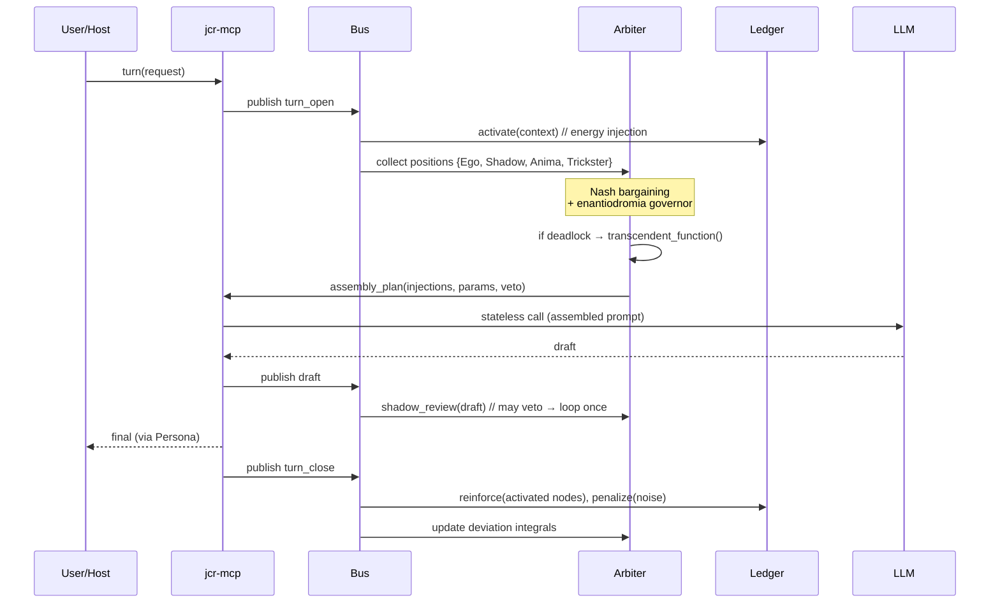

# 01 — Architecture

> `jcr-core` is the organism. `jcr-mcp` is a port. `jcr` never lives inside the model.

---

## 1. Process model

```
┌──────────────────────────────────────────────────────────────────────────────┐
│ jcr-core  (single long-running process)                                      │
│                                                                              │
│  ┌────────────┐   ┌──────────────┐   ┌───────────────┐   ┌────────────────┐  │
│  │  BUS       │   │  WORKERS     │   │  LEDGER       │   │  ARBITER       │  │
│  │ pub/sub    │◄─►│ psychoid     │◄─►│ libido field  │◄─►│ bargaining     │  │
│  │ event log  │   │ synchronicity│   │ SQLite + vec  │   │ enantiodromia  │  │
│  │            │   │ shadow       │   │ node/edge     │   │ transcendent   │  │
│  └─────┬──────┘   └──────────────┘   └───────────────┘   └───────┬────────┘  │
│        │                                                          │          │
│        └──────────────── control plane ──────────────────────────┘          │
└───────────────────────────────────┬──────────────────────────────────────────┘
                                    │  Unix socket / TCP
                          ┌─────────▼─────────┐
                          │  jcr-mcp (facade) │
                          └─────────┬─────────┘
                                    │  MCP (JSON-RPC)
                          ┌─────────▼─────────┐
                          │  host (opencode)  │
                          └───────────────────┘
```

**Why a daemon?** Because the core requirements are incompatible with request/response:

- the synchronicity monitor must run *while the host is idle*;
- enantiodromia is an integral over time, not a point query;
- psychoid sampling is continuous;
- the Shadow's cost ledger must accumulate between turns.

A single asyncio process (Python) or tokio process (Rust) is sufficient for v1. Scale-out is
explicitly out of scope; JCR is a personal cognitive runtime, not a distributed service.

---

## 2. The bus

All internal communication goes through an append-only event log with pub/sub fan-out. Nothing
calls anything directly — modules are decoupled by the bus. This is the concrete meaning of
"event-oriented network" rather than a call graph.

### Transport options (pick one; the interface is transport-agnostic)

| Transport | When |
|---|---|
| **In-process asyncio queues + SQLite event log** | v1 default; zero infra |
| Redis Streams | multi-process, persistence, consumer groups |
| NATS JetStream | many workers, replay, clustering |
| ZeroMQ | pure latency, no broker |

### Event envelope

Every event is a single JSON object validated against [`schemas/event.schema.json`](../schemas/event.schema.json):

```json
{
  "id": "evt_01J...",
  "ts": "2026-09-12T19:48:00.000Z",
  "kind": "resonance|crossing|activation|bid|veto|affect|inject|outcome|dream",
  "source": "synchronicity-monitor",
  "priority": 0.0,
  "payload": {},
  "caused_by": ["evt_..."],
  "provenance": { "session": "...", "turn": 14 }
}
```

`caused_by` gives the log a causal DAG — events can be replayed and audited. This is the
event-sourced substrate on which the whole runtime is rebuilt after a crash.

---

## 3. Workers

### 3.1 Psychoid sampler (`psychoid`)
- **Cadence:** adaptive, 0.2–5 Hz, backs off when idle.
- **Reads:** CPU, RAM, I/O, load, thermal (if available), tool exit codes, error rates, compile
  failures, git dirty state, wall-clock / session timing, latency of model calls.
- **Writes:** `affect` events with a low-dimensional vector `{tension, load, stability, fatigue}`.
- **LLM cost:** zero.

### 3.2 Synchronicity monitor (`synchronicity`)
- **Cadence:** on buffer change + heartbeat (e.g. every N seconds).
- **Reads:** the live context buffer (recent code, terminal, dialogue) embedded locally; the
  ledger's cold *and* hot nodes.
- **Computes:** topological resonance — similarity **weighted by graph distance** (a resonant node
  must be *far* in the graph; nearby nodes are just RAG).
- **Writes:** `resonance` events; `crossing` events only when the 3-condition filter passes.
- **LLM cost:** zero (local embeddings).
- See [docs/06](06-synchronicity.md).

### 3.3 Shadow daemon (`shadow`)
- **Cadence:** on Ego draft, plus a slow background scan of accumulated claims.
- **Reads:** Ego's draft, the claim set, the ledger.
- **Writes:** `veto` events, each carrying a **costly signal** — a reproducing test, a
  counterexample, a concrete counterfactual. Cheap-talk critiques are logged but carry zero weight.
- **LLM cost:** 1 call per audit (this is why it is Phase 2, not Phase 0).
- See [docs/02](02-game-theory.md) §4.

### 3.4 Dream worker (`dream`)
- **Cadence:** session end / idle.
- **Reads:** the session's events and blocks.
- **Writes:** `dream` events — generalized knowledge, error patterns, new invariants; triggers
  ledger consolidation and decay.
- **LLM cost:** optional; deterministic consolidation runs without it.
- Uses and extends `sint-dream`.

---

## 4. The control plane

One turn of interaction, end to end:



Key point: **the host never talks to the psyche directly.** It asks `jcr-mcp` for an
`assembly_plan`; the plan is produced by the arbiter from the state of the field. The model then
gets a stateless call, exactly as any API expects.

---

## 5. Facade (MCP tools)

Deliberately thin — the facade must not contain psychology.

| Tool | Purpose |
|---|---|
| `jcr_state()` | current affect, deviation axes, ledger summary |
| `jcr_poll_events(since, kinds)` | drain pending bus events (the pull side of push) |
| `jcr_plan(turn_context)` | produce an assembly plan for this turn |
| `jcr_observe(text)` | push the host's live buffer into the monitor |
| `jcr_inject(event_id)` | accept a surfaced resonance into the context (human/agent gate) |
| `jcr_arbitrate(positions_json)` | run bargaining over explicit positions (debug/override) |
| `jcr_outcome(label)` | label a surfaced event useful/useless (calibration feedback) |
| `jcr_shadow_review(draft_text)` | run a costly-signal audit |
| `jcr_dream(scope)` | trigger consolidation |

> **Design rule:** if a tool needs to know what "Shadow" means, it belongs in `jcr-core`, not in
> the facade.

---

## 6. Degradation ladder

The runtime must never make the host *worse* than a bare model. It degrades stepwise:

1. **Full:** all workers live.
2. **Lean:** synchronicity monitor throttled; psychoid at 0.2 Hz; Shadow on-demand only.
3. **Passive:** bus only; no background work; `jcr_plan` still answers from the last snapshot.
4. **Off:** facade returns an empty plan; the host behaves as a normal MCP-enabled agent.

Each step must be reachable by config and must be covered by a test that asserts the host still
functions.

---

## 7. Persistence & crash recovery

- **Ledger:** SQLite with a vector extension (`sqlite-vss`/`sqlite-vec`) or a sidecar index;
  nodes and edges in tables. All writes transactional.
- **Event log:** append-only JSONL + SQLite index. It *is* the source of truth; ledger state can be
  rebuilt by replay.
- **Identity/memory portability:** export = `{nodes, edges, event_log_tail, character_vector}`.
  Import into another host/provider must reproduce behavior within tolerance (see thesis §5.4).

---

## 8. What is intentionally out of scope

- Multi-user or multi-tenant operation.
- Distributed consensus.
- Training or fine-tuning the model.
- Any claim that the system is conscious. It is a control system with a rich internal state.
