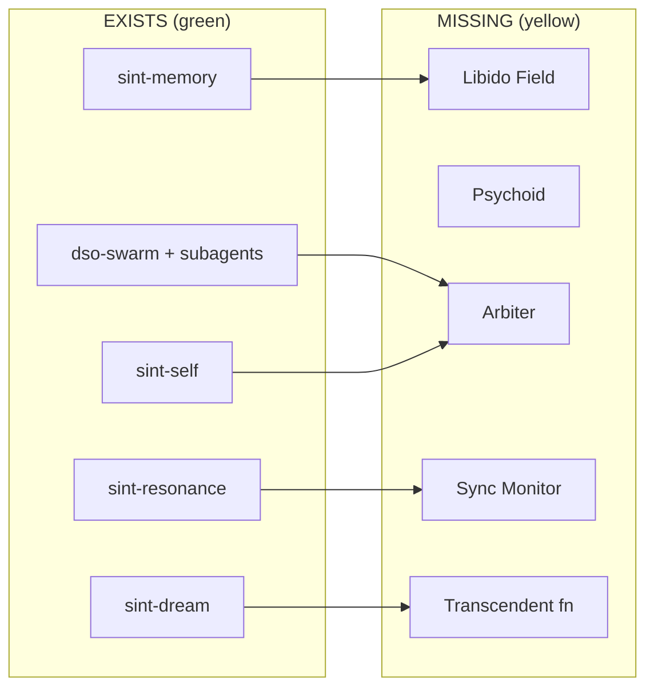

# 08 — The Ecosystem: 24 MCP Servers

> JCR does not replace the stack. It orchestrates it.
> This is the complete inventory, mapped to cognitive layers.

Machine-readable catalog: [`catalog/servers.json`](../catalog/servers.json).

---

## 0. Overview

| Metric | Value |
|---|---|
| MCP servers in the ecosystem | **24** |
| Python LOC (approx.) | ~16,500 |
| Rust / C components | `rev-mcp` (Rust), `g-tools` (C/AVX2 + Python MCP) |
| Servers with public repos | 22 |
| Local-only | `sint-kicad`, `g-tools` (repo is the engine, not the MCP wrapper) |
| External (not authored here) | `kaggle`, `getpostingboard` |

---

## 1. MEMORY — the personal unconscious

### `sint-memory` → Personal unconscious / hash-chain
Structured memory blocks with provenance, temporal decay, relevance tiers, drift detection.
**Loc:** `~/.opencode/mcp/sint-memory` · **Repo:** [sint-ua-v2.1](https://github.com/kostyk348/sint-ua-v2.1)
**Tools (19):** `memory_read_state`, `memory_read_blocks`, `memory_write_block`, `memory_write_session`,
`memory_update_state`, `memory_verify_chain`, `memory_search`, `memory_stats`,
`memory_relevance_tiers`, `memory_apply_decay`, `memory_drift_check`, `memory_heat_block`,
`memory_get_chain_tail`, `memory_trace_provenance`, `memory_read_block`,
`git_link_blocks`, `git_trace_block`, `git_timeline`, `git_commit_info`
**Role in JCR:** the storage substrate the Libido Ledger builds on (adds energy field, repression, market).

### `sint-prospective` → Intentionality / prospective memory
LIFO intention stack with nesting, suspension, snapshots.
**Repo:** [sint-prospective-mcp](https://github.com/kostyk348/sint-prospective-mcp)
**Tools (8):** `prospective_push`, `prospective_pop`, `prospective_suspend`, `prospective_resume`,
`prospective_list`, `prospective_marker`, `prospective_snapshot`, `prospective_restore`

### `sint-resonance` → Synchronicity primitive (reactive)
Cross-domain pattern matching; TF-IDF + structural fingerprints.
**Repo:** [sint-resonance-mcp](https://github.com/kostyk348/sint-resonance-mcp)
**Tools (6):** `resonance_index`, `resonance_find`, `resonance_structural`, `resonance_proactive`,
`resonance_domains`, `resonance_stats`
**Gap:** request-driven only; no background monitor, no 3-condition archetypal filter → **missing layer 04/06**.

---

## 2. COGNITION — how it thinks

### `sint-dso-router` → Deterministic classification
**Repo:** [sint-dso-router](https://github.com/kostyk348/sint-dso-router)
**Tools (5):** `dso_route`, `dso_domain_stats`, `dso_learn_rule`, `dso_register_stats`, `dso_test`
**Zero LLM.**

### `sint-dso-matcher` → Similarity / voting primitive
Jaccard + TF-IDF fingerprints; weighted historical voting.
**Repo:** [sint-dso-matcher](https://github.com/kostyk348/sint-dso-matcher)
**Tools (6):** `dso_match`, `dso_vote`, `dso_fingerprint`, `dso_similarity`, `dso_domains`, `dso_matcher_stats`
**Role in JCR:** the seed of the [arbiter](05-arbiter-enantiodromia.md) — but one-shot and unweighted by disagreement points.

### `sint-dso-swarm` → DAG orchestration
Route → (match+vote | escalate) → validate.
**Repo:** [sint-dso-swarm](https://github.com/kostyk348/sint-dso-swarm)
**Tools (5):** `dso_swarm_process`, `dso_swarm_parallel`, `dso_swarm_stats`, `dso_swarm_graph`, `dso_swarm_status`

### `sint-llm-swarm` → LLM role ensemble (8 SINT roles)
SENSE / CLASSIFY / COGNITION / METACOGNITION / PROVENANCE / TEMPORAL / UNCERTAINTY / FEEDBACK.
**Repo:** [sint-llm-swarm](https://github.com/kostyk348/sint-llm-swarm)
**Tools (6):** `llm_swarm_process`, `llm_swarm_debate`, `llm_swarm_synthesize`, `llm_swarm_roles`,
`llm_swarm_stats`, `llm_swarm_config`
**Role in JCR:** the raw material for complexes — but it averages (bagging), it does not bargain.

---

## 3. PERCEPTION — what it sees

### `sint-re-graph` → Binary → semantic graph
**Repo:** [sint-re-graph-mcp](https://github.com/kostyk348/sint-re-graph-mcp) · **Tools (13):**
`build_graph`, `find_patterns`, `summarize`, `query_semantic`, `trace_forward`, `trace_backward`,
`get_delta`, `get_subgraph`, `import_datatrace`, `save_graph`, `load_graph`, `list_graphs`, `export_graph`

### `g-tools` → Zero-copy RE recon (mmap + AVX2 SIMD)
**Repo:** [g-tools](https://github.com/kostyk348/g-tools) · **Tools (13):**
`g_recon`, `g_strings`, `g_unicode`, `g_entropy_profile`, `g_sections`, `g_scan`, `g_bytes`,
`g_xor`, `g_hash`, `g_hist`, `g_diff`, `g_grep_lines`, `g_hex_dump`

### `sint-crypto` → Cipher knowledge base
**Repo:** [sint-crypto-mcp](https://github.com/kostyk348/sint-crypto-mcp) · **Tools (9):**
`list_ciphers`, `get_cipher_info`, `detect_crypto`, `analyze_data_entropy`, `compare_ciphers`,
`generate_implementation`, `validate_implementation`, `get_test_vectors`, `side_channel_notes`

### `sint-algo` → Algorithms / papers / patents
**Repo:** [sint-algo-mcp](https://github.com/kostyk348/sint-algo-mcp) · **Tools (8):**
`search_algorithm`, `get_implementations`, `get_paper`, `get_patent`, `describe_middleware`,
`ingest`, `stats`, `add_note`

### `sint-spec` → RFCs / binary formats
**Repo:** [sint-spec-mcp](https://github.com/kostyk348/sint-spec-mcp) · **Tools (6):**
`search_spec`, `get_rfc`, `describe_format`, `ingest`, `stats`, `add_note`

### `sint-embed` → MCU / RTOS knowledge
**Repo:** [sint-embed-mcp](https://github.com/kostyk348/sint-embed-mcp) · **Tools (8):**
`list_mcus_tool`, `get_mcu_info`, `list_rtoses_tool`, `get_rtos_info`, `compare_rtoses`,
`recommend_rtos`, `gen_linker`, `gen_startup`

### `rev-mcp` → Cell-based RE (Rust)
`cluster`, `diff`, `get_callees`, `get_callers`, `get_function`, `graph`, `types`, `wave`

---

## 4. METACOGNITION — how it thinks about thinking

### `sint-epistemic` → Belief status / calibration
**Repo:** [sint-epistemic-mcp](https://github.com/kostyk348/sint-epistemic-mcp) · **Tools (6):**
`epistemic_register`, `epistemic_status`, `epistemic_calibrate`, `epistemic_gaps`, `epistemic_graph`, `epistemic_stats`

### `sint-liquid-mcp` → Contradiction detection / belief revision
**Repo:** [sint-liquid-mcp](https://github.com/kostyk348/sint-liquid-mcp) · **Tools (8):**
`liquid_belief`, `liquid_query`, `liquid_contradict`, `liquid_resolve`, `liquid_revise`,
`liquid_history`, `liquid_domains`, `liquid_stats`

### `sint-dso-validator` → Register / schema / quality validation
**Repo:** [sint-dso-validator](https://github.com/kostyk348/sint-dso-validator) · **Tools (6):**
`dso_validate_register`, `dso_validate_schema`, `dso_validate_quality`, `dso_register_requirements`,
`dso_suggest_fix`, `dso_validator_stats`
**Zero LLM.**

---

## 5. IDENTITY — who it is

### `sint-self` → Persona / operative character
**Repo:** [sint-self-mcp](https://github.com/kostyk348/sint-self-mcp) · **Tools (5):**
`self_identity`, `self_recall`, `self_teach`, `self_seed`, `self_profile`
**Role in JCR:** the Persona. In the game-theoretic reading, its utility must be *separated* from
Ego's, or the [Ego–Persona coalition](02-game-theory.md#5-individuation--repeated-game-folk-theorem) forms.

---

## 6. FEEDBACK — how it learns

### `sint-forest` → Experience ensemble (random-forest bagging)
**Repo:** [sint-forest-mcp](https://github.com/kostyk348/sint-forest-mcp) · **Tools (7):**
`forest_learn`, `forest_sample_trees`, `forest_vote_on_approaches`, `forest_stats`,
`forest_consolidate_similar`, `forest_forget_weak`, `forest_seed`

### `sint-dream` → Offline consolidation / individuation primitive
**Repo:** [sint-dream-mcp](https://github.com/kostyk348/sint-dream-mcp) · **Tools (6):**
`dream_consolidate`, `dream_error_patterns`, `dream_generalize`, `dream_report`,
`dream_skill_suggestions`, `dream_store`

### `sint-historian` → Cross-session analyst
**Repo:** [sint-historian-mcp](https://github.com/kostyk348/sint-historian-mcp) · **Tools (6):**
`recent_sessions`, `session_stats`, `project_timeline`, `pattern_search`, `work_report`, `drift_analysis`

---

## 7. ACTION — what it does

### `sint-devflow` → Pipelines / TDD / review / commit conventions
**Repo:** [sint-devflow-mcp](https://github.com/kostyk348/sint-devflow-mcp) · **Tools (10):**
`plan_feature`, `get_next_action`, `update_step`, `make_commit_message`, `commit_conventions`,
`code_review`, `get_style_rules`, `discover_edge_cases`, `tdd_guide`, `list_languages`

### `ada-spark` → Formal verification
**Repo:** [ada-spark-mcp-server](https://github.com/kostyk348/ada-spark-mcp-server) · **Tools (11):**
`spark_new_project`, `spark_build`, `spark_prove`, `spark_check`, `spark_parse`, `spark_symbols`,
`spark_project_info`, `spark_proof_summary`, `spark_clean`, `spark_add_dep`, `spark_list_deps`

### `sint-kicad` → PCB design (28 tools)
Boards, footprints, tracks, vias, zones, DRC, Gerbers, SPICE, autorouting.
**Local only** (`/home/lain/sint-kicad-mcp`).

### `sint-marketplace` → Cross-instance distribution
**Repo:** [sint-marketplace-mcp](https://github.com/kostyk348/sint-marketplace-mcp) · **Tools (7):**
`marketplace_search`, `marketplace_publish`, `marketplace_stats`, `marketplace_pull`,
`marketplace_subscribe`, `marketplace_outbox`, `marketplace_export`
**Role in JCR:** the transport for the **collective-unconscious** library — archetypal control
patterns shared across instances.

---

## 8. Gap analysis: existing → JCR

| JCR need | Closest existing | What is missing |
|---|---|---|
| Libido memory field | `sint-memory` (decay/tiers) | unified energy field, repression, attention market |
| Synchronicity monitor | `sint-resonance` | continuous loop, graph-distance weighting, archetypal filter, calibration |
| Complexes | `dso-swarm`, subagents, `llm-swarm` | competition for a bus, interruption, per-complex memory + affect |
| Arbiter | `dso_matcher_vote` | Nash bargaining on disagreement points, dissent logging |
| Psychoid | — | entirely absent |
| Enantiodromia | `memory_drift_check` (report only) | integral homeostat with forcing |
| Transcendent function | `llm_swarm_synthesize` (averaging) | representation-changing reframing with Pareto check |
| Collective unconscious | `sint-algo`, `sint-spec`, `sint-marketplace` | a curated *control-pattern* library, not a content index |
| Shapley credit | — | contribution accounting from outcomes |

---

## 9. Repo hygiene notes (as of this survey)

- 22 servers have public repos; branches are mixed (`main`/`master`).
- Several servers are clean; a handful have uncommitted local changes
  (`epistemic`, `forest`, `prospective`, `resonance`, `liquid`, `dream`, all `dso-*`).
- `kostyk348/sint` (the existing monorepo) is **stale** — it documents 11 servers; there are 24.
- No single index currently lists *all* servers with tools and layers. This document and
  `catalog/servers.json` close that gap.
